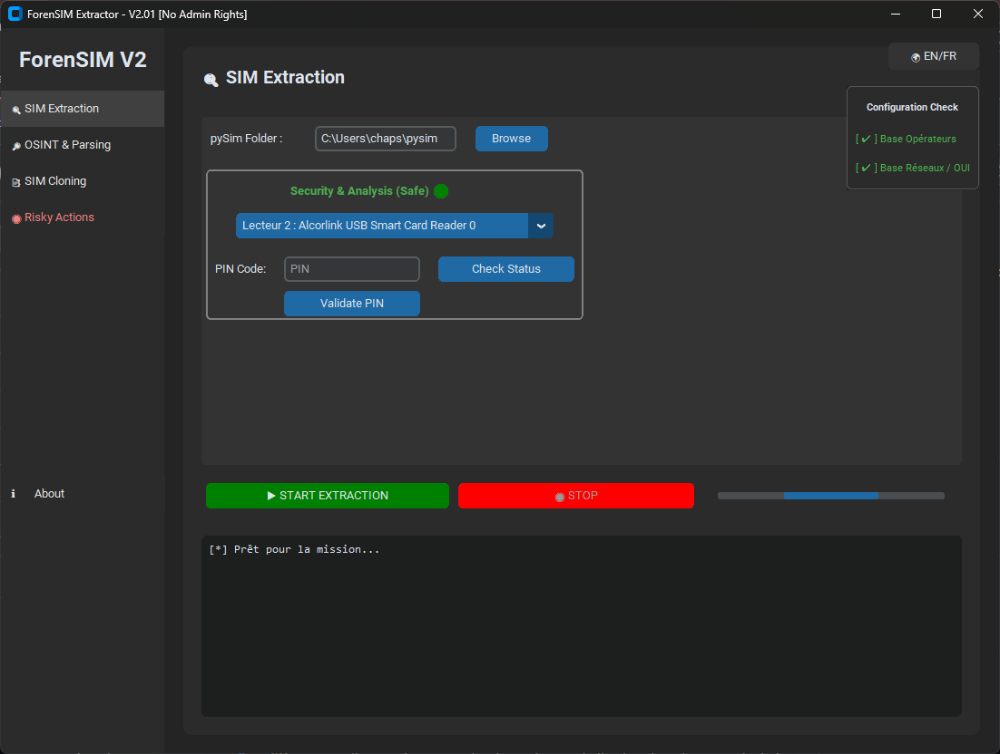

# ForenSIM V2.02 - Expert Edition
**Outil d'Investigation Numérique (Forensic) avancé pour cartes UICC / eUICC et SIM 2G.**

ForenSIM V2.01 est une interface graphique moderne (basée sur `CustomTkinter`) conçue pour s'interfacer avec le puissant moteur open-source **[pySim](https://gitea.osmocom.org/sim-card/pysim)** d'Osmocom. Il permet aux investigateurs, forces de l'ordre et professionnels de la cybersécurité d'automatiser l'extraction et l'analyse des cartes SIM de manière sécurisée et intègre.


## 🚀 Fonctionnalités Clés
- **Extraction "Universal Shotgun" (Nouveauté V2.01) :** Plus de bouton archaïque "2G" ou "USIM". Le moteur d'extraction lance une procédure agnostique exhaustive avec gestion de fallback silencieux via FIDs (ISO 7816) pour éviter les crashs sur les cartes MFF2 / eSIM et les cartes hybrides de dernière génération.
- **Traçage Réseau 4G / LTE (Nouveauté V2.01) :** Extraction cryptomographique profonde des fichiers EPSLOCI (6FE3) couplée aux LOCI (6F7E) conventionnels. Identifier le dernier PLMN de la carte avec notre nouveau parseur de sortie JSON natif pySim.
- **Diagnostic Matériel Intelligent :** Détection dynamique des lecteurs (PC/SC), évaluation de sécurité *"Gentle Poke"* (sans brûler de tentative PIN), interface d'aide au PINOUT matériel, et LED de connexion en temps réel.
- **Rapports Forensic Standardisés :** Génération automatique de `.txt` certifiés compatibles V1.0 avec extraction croisée IMSI/ICCID/MSISDN, et parsing de données profondes comme la `LANGUE`, le Service Provider (`SPN`) ou le `SMSC`.
- **Mise sous Scellé Numérique :** L'extraction physique bit-à-bit et logique sont encapsulées dans un algorithme de compression avec validation `SHA-256` intégrée.
- **Outils Intégrés :** Résolution MCC-MNC OSINT et utilitaire de clonage SIM à la volée sur sysmoISIM (Clés ADM supportées).
- **eUICC / eSIM (Nouveauté V2.02) :** Onglet dédié pour TCU connected car. Lecture **EID** (eUICC Identifier), liste des **profils installés** (ICCID + ISD-P AID + état + opérateur), dump des règles **ARA-M** (Access Rule Application Master), détection automatique de la norme GSMA (**SGP.02 M2M legacy**, **SGP.22 Consumer**, **SGP.32 IoT** post-2023). Génération de rapport forensic dédié.

## 🛠️ Installation & Pré-requis

### 1. Cloner ce dépôt
```bash
git clone https://github.com/chaps2442/ForenSIM.git
cd ForenSIM
```

### 2. Installer les dépendances Python
ForenSIM est construit avec Python 3 et nécessite les paquets ci-dessous :
```bash
pip install -r requirements.txt
```

### 3. Installer le moteur pySim (Requis)
ForenSIM V2.01 n'est pas fourni avec le moteur `pySim` (qui possède ses propres règles de gestion, voir Osmocom). Vous devez le télécharger ou le cloner à part, n'importe où sur votre machine :
```bash
# Exemple de clonage du moteur officiel PySim :
git clone https://gitea.osmocom.org/sim-card/pysim.git
```
*(Plus d'informations sur [pySim Dépôt Officiel](https://gitea.osmocom.org/sim-card/pysim))*

### 4. Configuration au lancement
Exécutez l'application :
```bash
python main.py
```
Lors de votre première utilisation, rendez-vous dans l'onglet **Extraction SIM** et cliquez sur le bouton "Parcourir" sous **"Dossier pySim :"** pour indiquer au logiciel où vous avez téléchargé le moteur Osmocom (étape 3). Ce chemin sera mémorisé pour les prochaines sessions.

---
## ⚖️ Avertissement Légal
ForenSIM est un utilitaire pensé pour accompagner le processus judiciaire et l'audit technique. Toute utilisation d'extraction, de contournement d'accès non autorisé, ou de falsification d'identité réseau (clonage) sur des puces dont vous ne possédez pas les autorisations explicites est illégale. 

Les contributeurs de ce code ne sauraient être tenus responsables de l'usage abusif de ces scripts.
